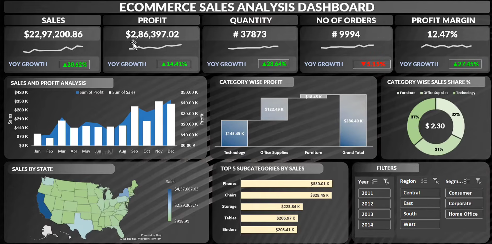

# Dynamic E-Commerce Sales Analysis Dashboard

## 📊 Project Overview

This project is a **dynamic and interactive E-Commerce Sales Analysis Dashboard** developed using Microsoft Excel.

The dashboard enables users to dynamically analyze sales performance, profitability, quantity, orders, profit margin, product categories, subcategories, regions, states, and customer segments.

Interactive filters and slicers allow users to change the analysis based on **Year, Region, and Customer Segment**, with the dashboard visuals and KPIs updating dynamically.

## 🖥️ Dashboard Preview



## 📌 Key Performance Indicators

| KPI | Value |
|---|---:|
| Total Sales | $2,297,200.86 |
| Total Profit | $286,397.02 |
| Total Quantity | 37,873 |
| Total Orders | 9,994 |
| Profit Margin | 12.47% |

## 📈 Dashboard Features

- Dynamic Sales & Profit Analysis
- Dynamic KPI Cards
- Category-wise Profit Analysis
- Category-wise Sales Share
- Sales by State
- Top 5 Subcategories by Sales
- Year-wise Analysis
- Region-wise Analysis
- Customer Segment Analysis
- Interactive Slicers and Filters
- Dynamic Charts and Visualizations

## 🛠️ Tools & Technologies

- Microsoft Excel
- PivotTables
- PivotCharts
- Slicers
- Excel Functions
- Data Cleaning
- Data Analysis
- Data Visualization
- Dashboard Design

## 🔍 Key Insights

- Technology generated the highest category-wise profit.
- Phones were the top-selling subcategory.
- Sales and profit trends can be analyzed dynamically on a monthly basis.
- Users can filter the dashboard by year, region, and customer segment.
- KPI cards and visualizations update based on the selected filters.

## 🎯 Project Objective

The objective of this project was to transform raw e-commerce sales data into a **dynamic, interactive, and visually appealing business dashboard** using Microsoft Excel.

The dashboard demonstrates how Excel can be used for data cleaning, analysis, visualization, and business intelligence.

## 📂 Project Files

```text
E-Commerce-Sales-Analysis/
│
├── Ecommerce_Sales_Dashboard.xlsx
├── dashboard.png
└── README.md
